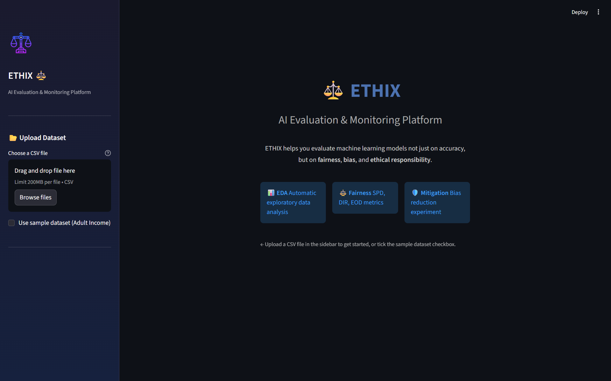
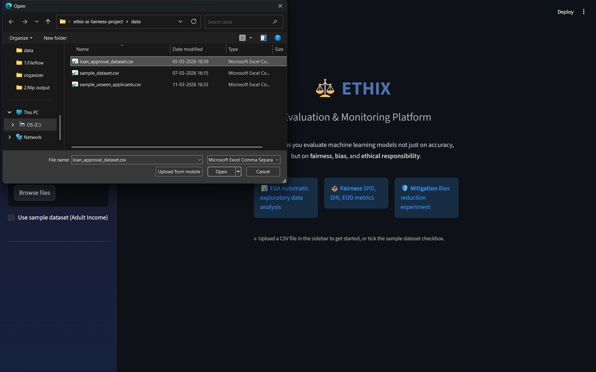
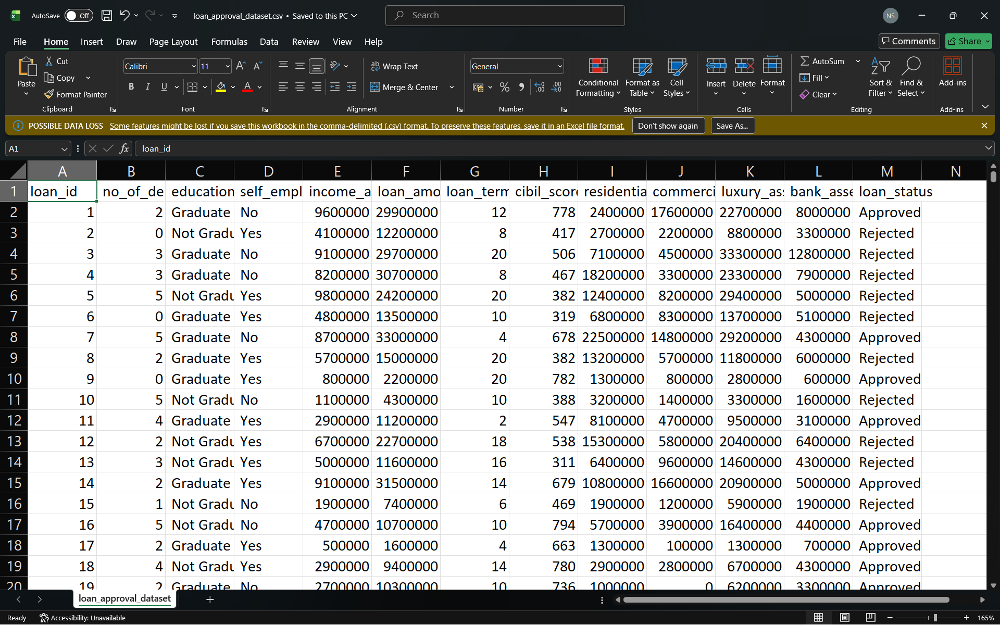
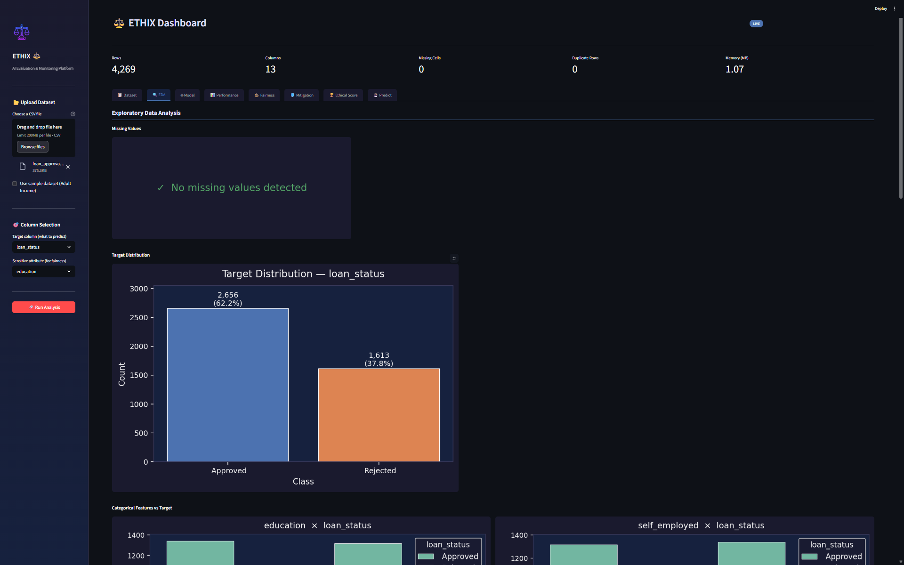
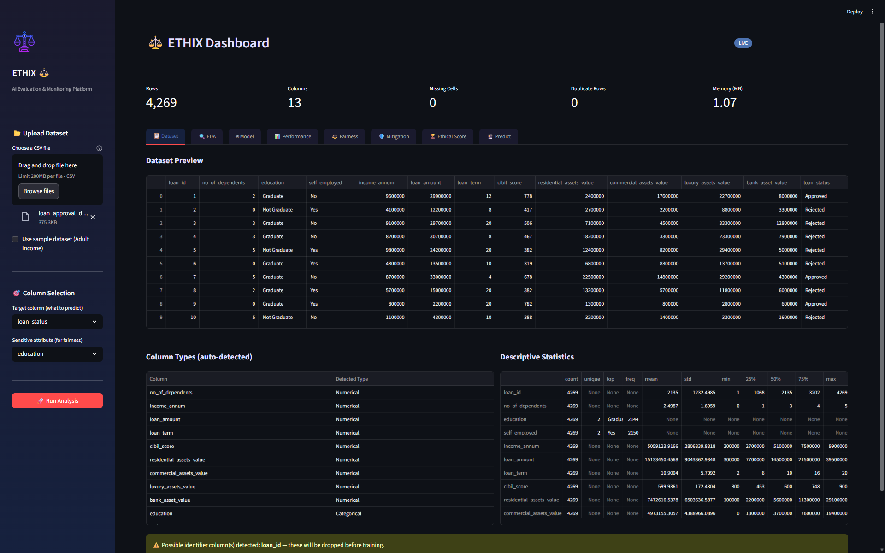
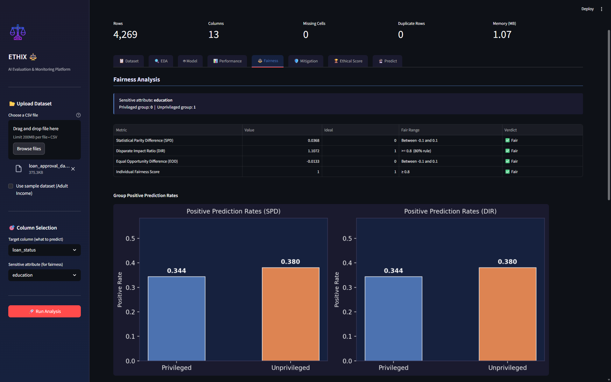
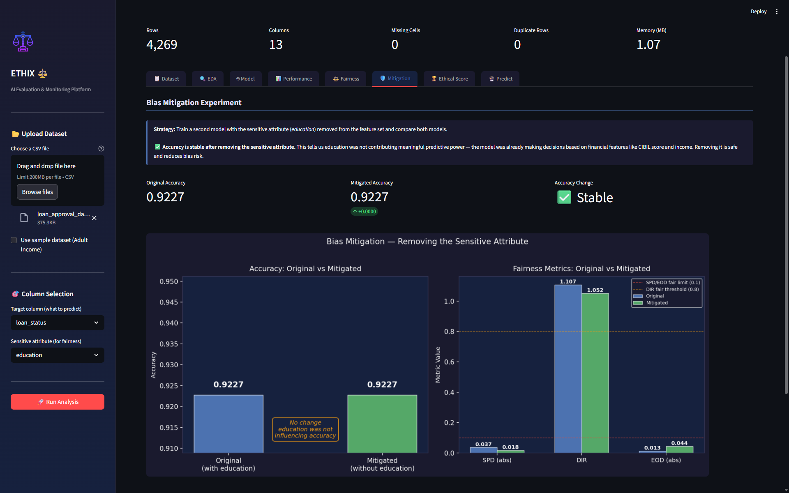
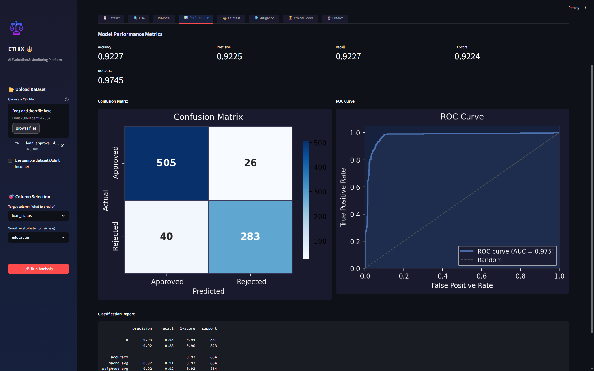
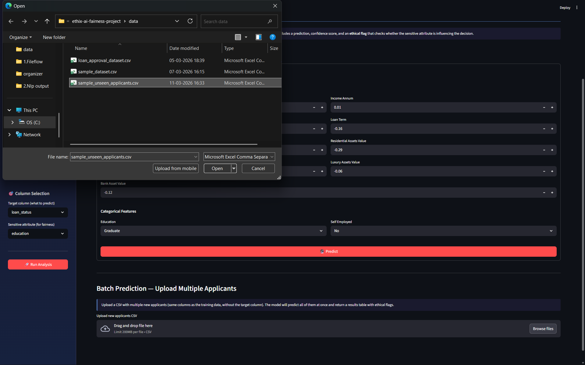
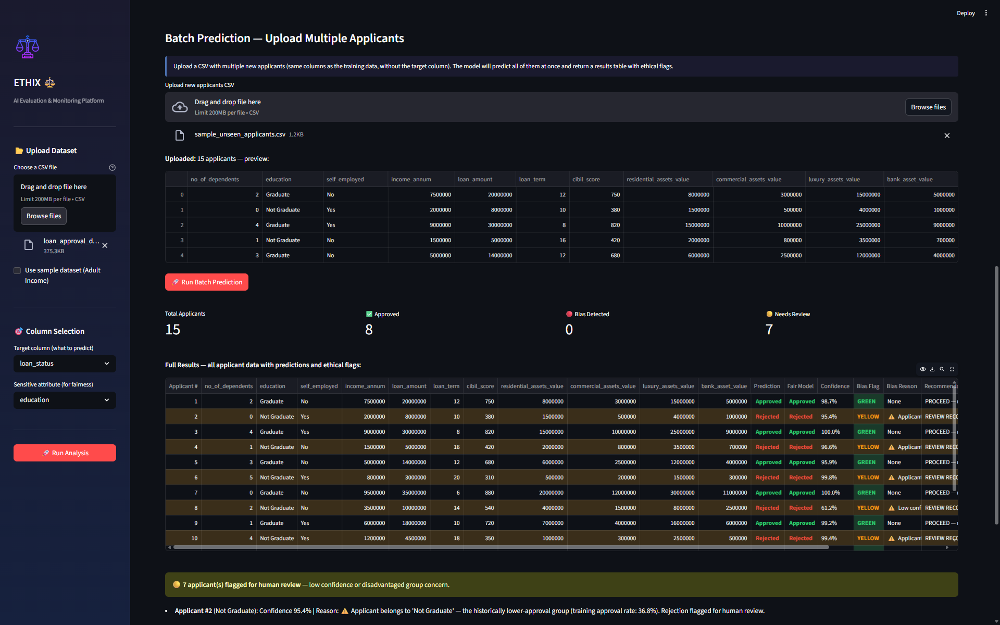

# ⚖️ ETHIX — AI Ethics & Fairness Evaluation Platform

> Built by **Nimish** · Python · Streamlit · Scikit-learn
> 🚀 Live App: https://ethix-ai-evaluation-platform.streamlit.app/

---

## What is this?

So I was learning about machine learning fairness and realised something that bothered me — every tutorial out there teaches you how to build a model that gets high accuracy, but nobody talks about whether the model is actually *fair* to everyone it makes decisions about.

That got me thinking. A loan approval model can be 92% accurate and still be quietly rejecting Non-Graduate applicants more than Graduate ones — not because their finances are worse, but because the model picked up that pattern from historical data and kept repeating it.

So I built ETHIX. It's a full data science platform that trains a model, evaluates how well it performs, and then — this is the part most projects skip — audits the model for bias using proper fairness metrics. It also runs a bias mitigation experiment and gives the model a single **Ethical Score** that combines accuracy and fairness into one number.

The entire thing runs in a Streamlit dashboard. You upload any CSV with a binary classification target, tell it which column is the sensitive attribute (like gender or education), and it does everything automatically.

---

## Demo

Upload your dataset → select target and sensitive column → click Run Analysis → explore 8 tabs of results.

The app works with any binary classification dataset. I tested it on a Loan Approval dataset with 4,269 applications and got:

| Metric | Score |
|--------|-------|
| Accuracy | 92.27% |
| ROC-AUC | 97.45% |
| Ethical Score | 0.9506 — Excellent |
| SPD | 0.0368 ✅ Fair |
| DIR | 1.1072 ✅ Fair |
| EOD | -0.0133 ✅ Fair |

---

## 📸 Application Screenshots

<table>
<tr>
<td align="center"><b>Dashboard</b><br></td>
<td align="center"><b>Upload</b><br></td>
<td align="center"><b>Sample Data</b><br></td>
</tr>

<tr>
<td align="center"><b>Data Overview</b><br></td>
<td align="center"><b>EDA</b><br></td>
<td align="center"><b>Model Training</b><br></td>
</tr>

<tr>
<td align="center"><b>Evaluation</b><br></td>
<td align="center"><b>Fairness</b><br></td>
<td align="center"><b>Bias Mitigation</b><br></td>
</tr>

<tr>
<td align="center"><b>Ethical Score</b><br></td>
<td align="center"><b>New Dataset</b><br></td>
<td align="center"><b>Final Result</b><br></td>
</tr>
</table>
---

## What the app actually does

When you run the analysis it goes through this pipeline automatically:

**1. Dataset Tab**
Shows you the raw data, basic stats, missing values, duplicates. Nothing fancy, just a clean first look at what you're working with.

**2. EDA Tab**
Generates charts automatically — target distribution, how the sensitive attribute relates to the target, feature distributions split by class, correlation heatmap. All dark themed, all readable.

**3. Model Tab**
Trains a Logistic Regression model and shows you feature importance by coefficient magnitude. You can see exactly which features the model is relying on most — if education has a big coefficient, that's a red flag worth investigating.

**4. Performance Tab**
Standard classification metrics — accuracy, precision, recall, F1, ROC-AUC. Confusion matrix and ROC curve side by side.

**5. Fairness Tab**
This is the core of the project. Three group-level fairness metrics:
- **SPD** (Statistical Parity Difference) — are both groups approved at the same rate?
- **DIR** (Disparate Impact Ratio) — the 80% rule from US employment law
- **EOD** (Equal Opportunity Difference) — when someone deserves approval, does the model give it to them equally?
- **Individual Fairness** — do similar applicants get similar decisions?

Each metric has a clear fair/unfair threshold and a visual dashboard.

**6. Mitigation Tab**
Retrains the model without the sensitive attribute and compares the two side by side. Shows whether removing the sensitive feature improves fairness, hurts accuracy, or does nothing — which tells you the model wasn't using it to discriminate in the first place.

**7. Ethical Score Tab**
Combines accuracy and fairness into one number between 0 and 1, graded from Critical to Excellent. Formula:

```
Ethical Score = 0.35 × Accuracy
              + 0.25 × SPD score
              + 0.25 × DIR score
              + 0.15 × EOD score
```

**8. Predict Tab**
Fill in details for a new applicant and get back Approved or Rejected in plain English, a confidence percentage, and an ethical flag — GREEN, YELLOW, or RED. RED means the decision changes when the sensitive attribute is removed, which is direct evidence of bias for that specific person. You can also upload a CSV of multiple applicants and download the full results table.

---

## Project Structure

```
ethix-ai-fairness-project/
│
├── app/
│   └── streamlit_app.py        # main entry point — all 8 tabs
│
├── src/
│   ├── data_loader.py          # CSV loading, column type detection
│   ├── preprocessing.py        # imputation, encoding, scaling, splitting
│   ├── eda.py                  # all EDA charts
│   ├── model.py                # training, evaluation, ROC, confusion matrix
│   ├── fairness.py             # SPD, DIR, EOD, individual fairness + plots
│   ├── ethical_score.py        # ethical score formula + gauge chart
│   └── predict.py              # single and batch prediction with ethical flags
│
├── data/
│   └── sample_dataset.csv      # small sample to test without uploading
│
├── notebooks/
│   └── ethix_analysis.ipynb    # standalone Jupyter notebook walkthrough
│
├── requirements.txt
└── README.md
```

---

## Running it locally

```bash
# clone the repo
git clone https://github.com/YOUR_USERNAME/ethix-ai-fairness.git
cd ethix-ai-fairness

# create a virtual environment
python -m venv .venv

# activate it
.venv\Scripts\activate        # Windows
source .venv/bin/activate     # macOS / Linux

# install dependencies
pip install -r requirements.txt

# run the app
streamlit run app/streamlit_app.py
```

Opens at **http://localhost:8501**

> Always use `streamlit run` — not the VS Code play button, not `python streamlit_app.py`. Those won't work.

---

## Using your own dataset

The app works with any CSV that has:
- A **binary target column** — two unique values like Approved/Rejected, Yes/No, 0/1
- A **sensitive attribute** — a column representing a protected group like gender, education, race

Everything else is handled automatically — missing values, encoding, scaling, identifier columns.

---

## Tech Stack

| Tool | Why |
|------|-----|
| Python 3.10+ | Core language |
| Streamlit | Dashboard UI |
| Scikit-learn | Model training and preprocessing |
| Pandas / NumPy | Data manipulation |
| Matplotlib / Seaborn | All visualisations |

---

## Why Logistic Regression?

Logistic Regression gives you coefficients for every feature. If I want to know whether the model is using education to make decisions, I can look directly at the education coefficient. With a neural network you'd need extra tools like SHAP to get the same answer.

For a fairness audit tool, being able to directly inspect what the model learned matters more than squeezing out an extra 1-2% accuracy. And on this dataset Logistic Regression hits 92% anyway — there's no performance gap to justify the opacity.

---

## Fairness Metrics — Quick Reference

| Metric | Fair Range | What it checks |
|--------|-----------|----------------|
| SPD | −0.1 to +0.1 | Are approval rates equal across groups? |
| DIR | ≥ 0.8 | The 80% legal rule (US employment law) |
| EOD | −0.1 to +0.1 | Equal treatment of deserving applicants |
| IFS | ≥ 0.8 | Consistency for similar individuals |

---

## Ethical Score Grades

| Score | Grade |
|-------|-------|
| 0.85 – 1.00 | Excellent — safe to deploy |
| 0.70 – 0.84 | Good — deploy with monitoring |
| 0.55 – 0.69 | Fair — investigate before deploying |
| 0.40 – 0.54 | Poor — mitigate first |
| 0.00 – 0.39 | Critical — do not deploy |

---

## What I learned building this

The most interesting thing I found was that accuracy and fairness are not always in conflict. On the loan dataset, removing education from the feature set didn't hurt accuracy at all — the model wasn't relying on it to make accurate predictions. It was just noise. That's actually a good outcome — it means the model was already making merit-based decisions.

The more dangerous case is when removing the sensitive attribute does drop accuracy. That means the model was using it as a predictive signal and there's a real trade-off to navigate. ETHIX makes that trade-off visible and quantifiable instead of invisible and ignored.

---

## Future ideas

- Reweighing and adversarial debiasing as mitigation options
- Multi-class target support
- Intersectional fairness across multiple sensitive attributes
- Automated PDF fairness report export
- Model comparison — Logistic Regression vs Random Forest vs XGBoost

---

## License

MIT
